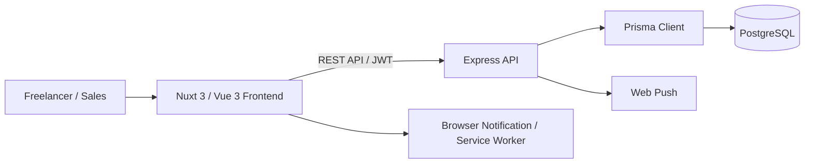
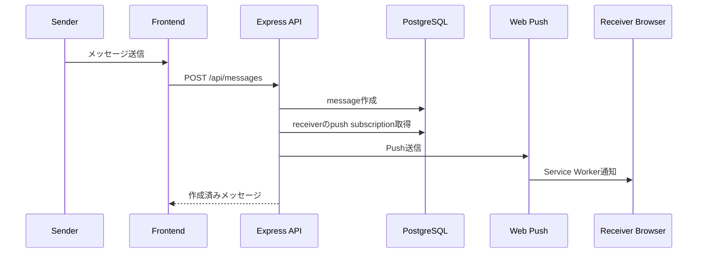

# 01. アーキテクチャ設計

## 1. 全体構成



## 2. 技術スタック

| レイヤー       | 技術                                                                          |
| -------------- | ----------------------------------------------------------------------------- |
| フロントエンド | Nuxt 3, Vue 3, TypeScript                                                     |
| UI構成         | Atomic Design風の `atoms` / `molecules` / `organisms` / `pages` / `templates` |
| 状態管理       | Vue `ref` / `computed` による composable 管理                                 |
| API            | Express 5, TypeScript                                                         |
| バリデーション | Zod                                                                           |
| ORM            | Prisma 7                                                                      |
| DB             | PostgreSQL 16                                                                 |
| 認証           | JWT, bcrypt                                                                   |
| 暗号化         | AES-256-GCM, HMAC-SHA256                                                      |
| 通知           | Web Push, Service Worker                                                      |
| 開発環境       | Docker Compose, npm scripts                                                   |

## 3. ディレクトリ構成

```text
TRYANGLE FREELANCE/
  app.vue
  pages/
    index.vue
  components/
    atoms/
    molecules/
    organisms/
    pages/
    templates/
  composables/
    useTryangleFreelance.ts
  backend/
    src/
      application/
      domain/
      infrastructure/
      interfaces/http/
  prisma/
    schema.prisma
    migrations/
    seed.ts
  public/
    push-sw.js
  src/
    styles.css
  docker-compose.yml
  nuxt.config.ts
  package.json
```

## 4. フロントエンド構成

### 4.1 エントリポイント

| ファイル                              | 役割                                              |
| ------------------------------------- | ------------------------------------------------- |
| `app.vue`                             | Nuxtアプリのルート                                |
| `pages/index.vue`                     | 単一ページアプリとして主要UIを表示                |
| `components/templates/AppShell.vue`   | ログイン後のアプリケーションレイアウト            |
| `composables/useTryangleFreelance.ts` | 画面状態、API通信、認証、画面遷移、業務操作を集約 |

### 4.2 コンポーネント分類

| 分類      | 例                                                              | 役割                         |
| --------- | --------------------------------------------------------------- | ---------------------------- |
| atoms     | `BaseButton`, `StatusBadge`, `ToastMessage`                     | 汎用的な最小UI部品           |
| molecules | `JobCard`, `FreelancerCard`, `FormInput`                        | 小さな機能単位のUI           |
| organisms | `LoginPanel`, `ProfileWizard`, `MeetingChat`, `SelectionKanban` | 複数部品を組み合わせた業務UI |
| pages     | `DashboardPage`, `JobsPage`, `AdminPage`                        | 画面単位のUI                 |
| templates | `AppShell`                                                      | 共通レイアウト               |

## 5. バックエンド構成

| レイヤー        | ファイル                                                        | 役割                                                       |
| --------------- | --------------------------------------------------------------- | ---------------------------------------------------------- |
| interfaces/http | `app.ts`, `server.ts`, `middleware.ts`, `schemas.ts`            | ルーティング、HTTP入出力、認証ミドルウェア、バリデーション |
| application     | `services.ts`, `mappers.ts`                                     | ユースケース、DB操作、レスポンス整形                       |
| domain          | `types.ts`                                                      | ロール、ステータス、ラベル変換、アプリケーションエラー     |
| infrastructure  | `config.ts`, `crypto.ts`, `security.ts`, `prisma.ts`, `push.ts` | 環境変数、暗号化、JWT、Prisma接続、Web Push                |

## 6. 通信方式

- フロントエンドは `http://127.0.0.1:8787/api` をAPIベースURLとして利用する。
- 認証後、JWTを `Authorization: Bearer <token>` ヘッダーで送信する。
- APIのリクエスト/レスポンスはJSON形式。
- CORS許可オリジンは `CORS_ORIGIN` でカンマ区切り設定する。

## 7. データ永続化

- PostgreSQLに永続化する。
- Prisma schemaを正とし、マイグレーションでDBを構築する。
- フロントエンド側にも `localStorage` を使った状態保持があるが、認証済みワークスペースデータはAPIから再取得する設計になっている。

## 8. 通知構成


