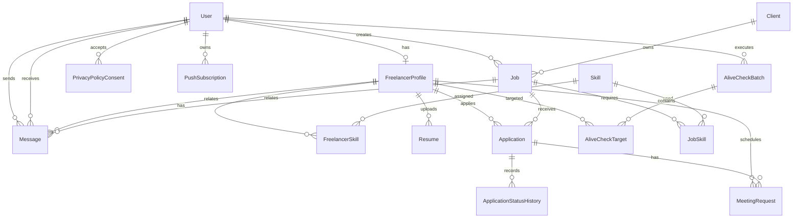

# 04. データベース設計

## 1. 概要

DBはPostgreSQLを使用し、Prisma schemaでモデルを定義する。主なデータ領域は、ユーザー、求職者プロフィール、スキル、案件、応募、面談、メッセージ、稼働確認、プライバシー同意、Web Push購読である。

## 2. ER図

## 3. テーブル一覧

| Prisma Model               | 物理テーブル                   | 概要                                       |
| -------------------------- | ------------------------------ | ------------------------------------------ |
| `User`                     | `users`                        | 認証ユーザー。求職者・営業の共通アカウント |
| `PasswordResetToken`       | `password_reset_tokens`        | パスワード再設定用の期限付きトークン       |
| `FreelancerProfile`        | `freelancer_profiles`          | 求職者プロフィール                         |
| `Skill`                    | `skills`                       | スキルマスタ                               |
| `FreelancerSkill`          | `freelancer_skills`            | 求職者とスキルの関連                       |
| `Resume`                   | `resumes`                      | レジュメメタ情報                           |
| `UploadedFile`             | `uploaded_files`               | Blob保存ファイルのメタ情報                 |
| `Client`                   | `clients`                      | クライアント企業                           |
| `Job`                      | `jobs`                         | 案件                                       |
| `JobSkill`                 | `job_skills`                   | 案件とスキルの関連                         |
| `Application`              | `applications`                 | 案件応募                                   |
| `ApplicationStatusHistory` | `application_status_histories` | 応募ステータス変更履歴                     |
| `MeetingRequest`           | `meeting_requests`             | 面談候補                                   |
| `Message`                  | `messages`                     | チャット/スカウト/稼働確認メッセージ       |
| `AliveCheckBatch`          | `alive_check_batches`          | 稼働確認の実行単位                         |
| `AliveCheckTarget`         | `alive_check_targets`          | 稼働確認対象者                             |
| `PrivacyPolicyConsent`     | `privacy_policy_consents`      | プライバシーポリシー同意履歴               |
| `PushSubscription`         | `push_subscriptions`           | Web Push購読情報                           |

## 4. Enum定義

| Enum                      | 値                                                            | 説明               |
| ------------------------- | ------------------------------------------------------------- | ------------------ |
| `UserRole`                | `freelancer`, `sales`                                         | ユーザーロール     |
| `RemoteType`              | `full_remote`, `hybrid`, `onsite`                             | リモート条件       |
| `AvailabilityStatus`      | `ready`, `scheduled`, `paused`                                | 求職者の稼働状況   |
| `SkillCategory`           | `language`, `database`, `framework`, `cloud`, `tool`, `other` | スキル分類         |
| `StreamType`              | `end_direct`, `prime`, `secondary`, `other`                   | 商流               |
| `JobSkillRequirementType` | `required`, `nice`                                            | 必須/歓迎スキル    |
| `ApplicationStatus`       | `screening`, `meeting_pending`, `contracted`, `rejected`      | 応募ステータス     |
| `MeetingStatus`           | `candidate`, `confirmed`, `reschedule`                        | 面談候補ステータス |
| `MessageType`             | `chat`, `scout`, `alive_check`, `system`                      | メッセージ種別     |

## 5. 主要テーブル詳細

### 5.1 users

| カラム          | 型            | NULL | 概要                        |
| --------------- | ------------- | ---: | --------------------------- |
| `id`            | UUID          |   NO | 主キー                      |
| `role`          | UserRole      |   NO | `freelancer` または `sales` |
| `name`          | varchar(1000) |   NO | 暗号化対象                  |
| `email`         | varchar(1000) |   NO | 暗号化対象                  |
| `email_hash`    | varchar(128)  |  YES | メール検索用HMAC。一意      |
| `password_hash` | varchar(255)  |   NO | bcryptハッシュ              |
| `phone`         | varchar(1000) |  YES | 暗号化対象                  |
| `is_active`     | boolean       |   NO | 有効状態                    |
| `last_login_at` | timestamptz   |  YES | 最終ログイン日時            |
| `created_at`    | timestamptz   |   NO | 作成日時                    |
| `updated_at`    | timestamptz   |   NO | 更新日時                    |

### 5.2 freelancer_profiles

| カラム                | 型                 | NULL | 概要                   |
| --------------------- | ------------------ | ---: | ---------------------- |
| `id`                  | UUID               |   NO | 主キー                 |
| `user_id`             | UUID               |   NO | `users.id`。一意       |
| `public_code`         | varchar(100)       |   NO | 公開用コード。一意     |
| `role_title`          | varchar(255)       |  YES | 職種/ロール            |
| `years_experience`    | decimal(4,1)       |  YES | 経験年数               |
| `desired_rate`        | int                |  YES | 希望単価               |
| `start_date`          | date               |  YES | 稼働開始日             |
| `work_rate`           | varchar(50)        |  YES | 稼働率                 |
| `remote_type`         | RemoteType         |  YES | リモート条件           |
| `availability_status` | AvailabilityStatus |  YES | 稼働状況               |
| `availability_note`   | varchar(255)       |  YES | 稼働状況補足           |
| `pledged_at`          | timestamptz        |  YES | 誓約同意日時           |
| `last_updated_on`     | date               |  YES | プロフィール最終更新日 |

### 5.3 jobs

| カラム        | 型           | NULL | 概要             |
| ------------- | ------------ | ---: | ---------------- |
| `id`          | UUID         |   NO | 主キー           |
| `client_id`   | UUID         |  YES | `clients.id`     |
| `title`       | varchar(255) |   NO | 案件名           |
| `summary`     | text         |  YES | 案件概要         |
| `rate_min`    | int          |   NO | 単価下限         |
| `rate_max`    | int          |   NO | 単価上限         |
| `margin_rate` | decimal(5,2) |   NO | マージン率       |
| `stream_type` | StreamType   |   NO | 商流             |
| `remote_type` | RemoteType   |   NO | リモート条件     |
| `is_pinned`   | boolean      |   NO | 優先表示         |
| `is_active`   | boolean      |   NO | 公開状態         |
| `created_by`  | UUID         |  YES | 作成営業ユーザー |

### 5.4 applications

| カラム                  | 型                | NULL | 概要           |
| ----------------------- | ----------------- | ---: | -------------- |
| `id`                    | UUID              |   NO | 主キー         |
| `job_id`                | UUID              |   NO | 応募先案件     |
| `freelancer_profile_id` | UUID              |   NO | 応募者         |
| `status`                | ApplicationStatus |   NO | 応募ステータス |
| `applied_at`            | timestamptz       |   NO | 応募日時       |
| `updated_at`            | timestamptz       |   NO | 更新日時       |

制約: `job_id` と `freelancer_profile_id` の組み合わせは一意。重複応募を防止する。

### 5.5 messages

| カラム                  | 型          | NULL | 概要           |
| ----------------------- | ----------- | ---: | -------------- |
| `id`                    | UUID        |   NO | 主キー         |
| `sender_user_id`        | UUID        |   NO | 送信者         |
| `receiver_user_id`      | UUID        |  YES | 受信者         |
| `freelancer_profile_id` | UUID        |  YES | 関連求職者     |
| `job_id`                | UUID        |  YES | 関連案件       |
| `message_type`          | MessageType |   NO | メッセージ種別 |
| `body`                  | text        |   NO | 暗号化対象     |
| `sent_at`               | timestamptz |   NO | 送信日時       |
| `read_at`               | timestamptz |  YES | 既読日時       |

## 6. 個人情報・秘匿情報

以下はアプリケーション側でAES-256-GCM暗号化される設計である。

| データ                         | 保存先                                                        |
| ------------------------------ | ------------------------------------------------------------- |
| ユーザー氏名                   | `users.name`                                                  |
| メールアドレス                 | `users.email`                                                 |
| 電話番号                       | `users.phone`                                                 |
| レジュメファイル名             | `resumes.original_filename`                                   |
| メッセージ本文                 | `messages.body`                                               |
| プライバシー同意時のIPアドレス | `privacy_policy_consents.ip_address`                          |
| プライバシー同意時のUser-Agent | `privacy_policy_consents.user_agent`                          |
| Push購読情報                   | `push_subscriptions.endpoint`, `p256dh`, `auth`, `user_agent` |

検索が必要なメールアドレスやPush endpointは、平文検索ではなくHMACハッシュ列を併用する。

## 7. インデックス・制約

| テーブル              | 制約/インデックス                           | 目的                                 |
| --------------------- | ------------------------------------------- | ------------------------------------ |
| `users`               | `email_hash` unique                         | メールアドレス重複防止・ログイン検索 |
| `freelancer_profiles` | `user_id` unique                            | 1ユーザー1プロフィール               |
| `freelancer_profiles` | `availability_status`, `remote_type` index  | 候補者検索                           |
| `skills`              | `name, category` unique                     | スキルマスタ重複防止                 |
| `applications`        | `job_id, freelancer_profile_id` unique      | 重複応募防止                         |
| `applications`        | `status` index                              | ステータス検索                       |
| `meeting_requests`    | `freelancer_profile_id, candidate_at` index | 面談候補取得                         |
| `messages`            | `freelancer_profile_id, sent_at` index      | チャット取得                         |
| `push_subscriptions`  | `endpoint_hash` unique                      | Push購読の重複防止                   |
