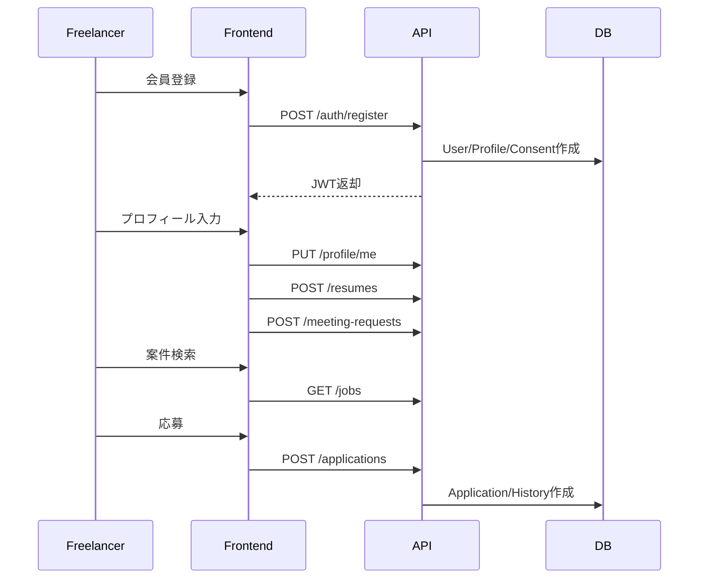
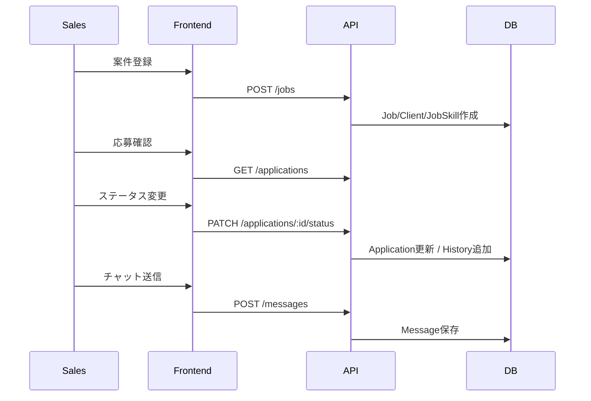

# 07. 未決事項・改善候補

## 1. 実装から見える未決事項

| ID      | 項目                 | 現状                                                | 推奨対応                                                |
| ------- | -------------------- | --------------------------------------------------- | ------------------------------------------------------- |
| OPN-001 | APIベースURL         | フロントエンドで `http://127.0.0.1:8787/api` が固定 | runtime config / 環境変数化                             |
| OPN-002 | レジュメファイル保存 | DBにはメタ情報のみ。ファイル本体の保存処理は未確認  | S3等の保存先、署名URL、削除方針、ウイルススキャンを設計 |
| OPN-003 | 本番インフラ         | ソース内には本番構成の記述なし                      | hosting, DB, secrets, network, monitoringを定義         |
| OPN-004 | ログ設計             | エラー時の `console.error` 中心                     | 構造化ログ、request id、監査ログの設計                  |
| OPN-005 | 既読管理             | `messages.read_at` は存在するが更新APIなし          | 既読APIまたは取得時更新方針を決める                     |
| OPN-006 | メール通知           | 実装なし                                            | 必要なら面談確定/応募通知/スカウト通知にメールを追加    |
| OPN-007 | Rate Limit           | 実装なし                                            | ログイン、登録、メッセージ送信に制限を追加              |
| OPN-008 | 権限粒度             | `freelancer` / `sales` の2ロール                    | 管理者、閲覧専用、営業リーダーなどが必要か検討          |
| OPN-009 | テスト               | テストコードは未確認                                | API・サービス・E2Eテストを追加                          |
| OPN-010 | OpenAPI              | API仕様はコード上のルート定義のみ                   | OpenAPI YAMLを生成・管理                                |

## 2. 追加するとよい設計書

| ドキュメント               | 内容                                                              |
| -------------------------- | ----------------------------------------------------------------- |
| OpenAPI仕様                | リクエスト/レスポンススキーマ、エラーコード、認証方式を機械可読化 |
| 画面遷移図                 | ロール別の画面遷移と認証状態の整理                                |
| 業務フロー図               | 応募、選考、面談、成約、見送りの流れ                              |
| インフラ構成図             | 本番/検証/開発環境、DB、Secrets、通知、ストレージ                 |
| 運用手順書                 | 障害対応、DBバックアップ、鍵ローテーション、リリース手順          |
| セキュリティチェックリスト | 個人情報、ログ、権限、暗号鍵、脆弱性対応                          |

## 3. 優先度の高い改善

1. `API_BASE` の環境変数化
2. レジュメファイルの保存・取得・削除設計
3. 本番用 `DATA_ENCRYPTION_KEY` / `JWT_SECRET` / VAPID鍵の管理手順策定
4. ログイン・登録APIへのRate Limit導入
5. OpenAPI仕様の整備
6. E2Eテストで主要業務フローを保護

## 4. 主要業務フロー案

### 4.1 求職者登録から案件応募まで

### 4.2 営業の選考管理

