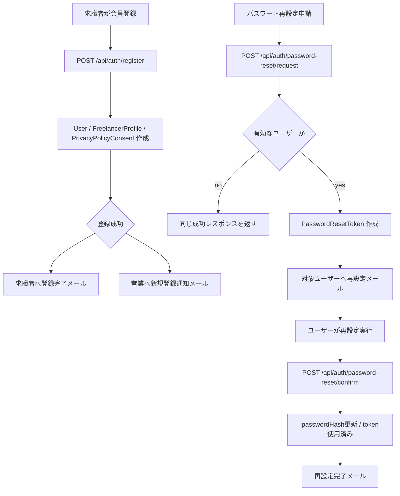
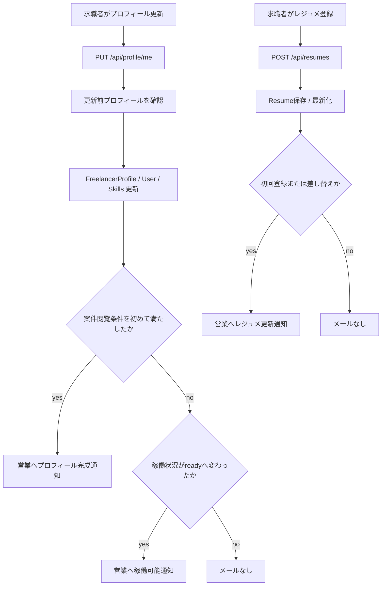
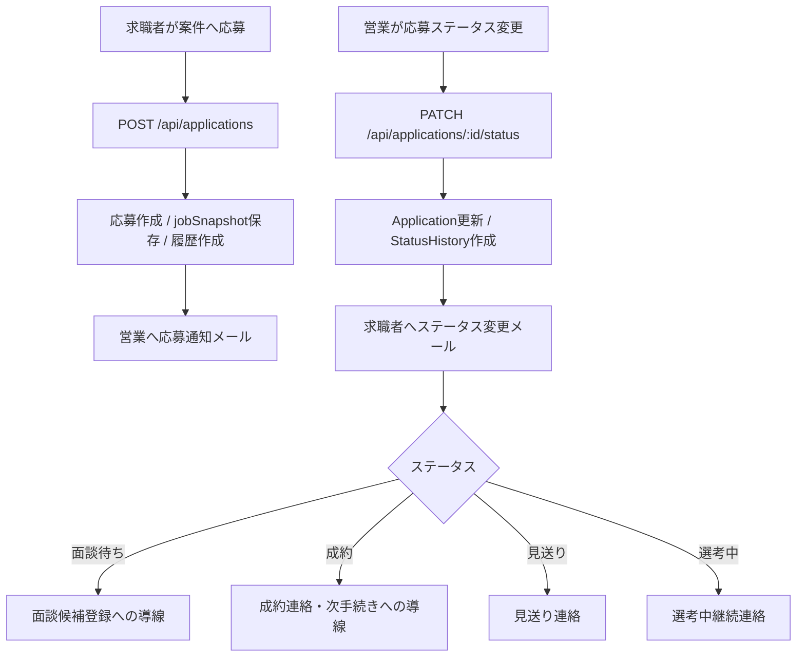
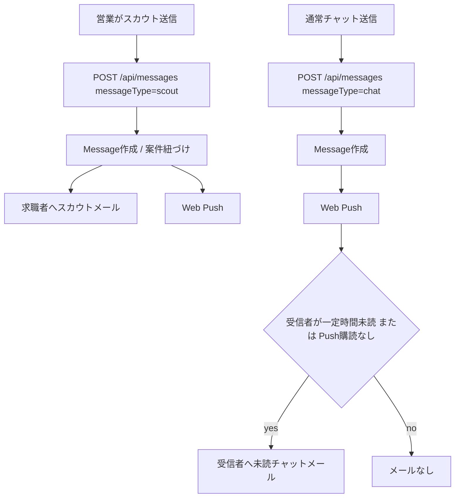
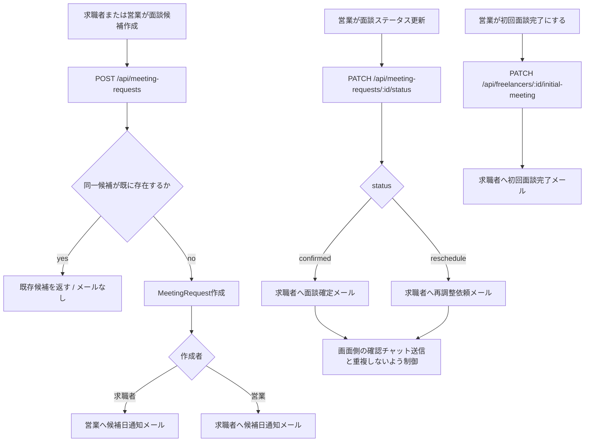
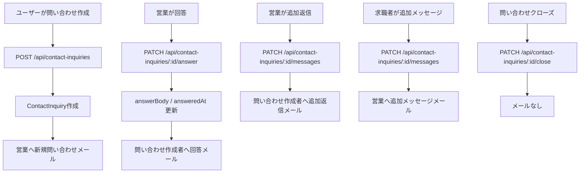
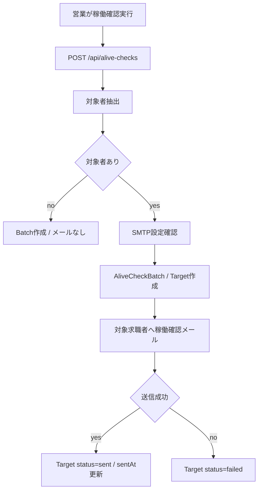
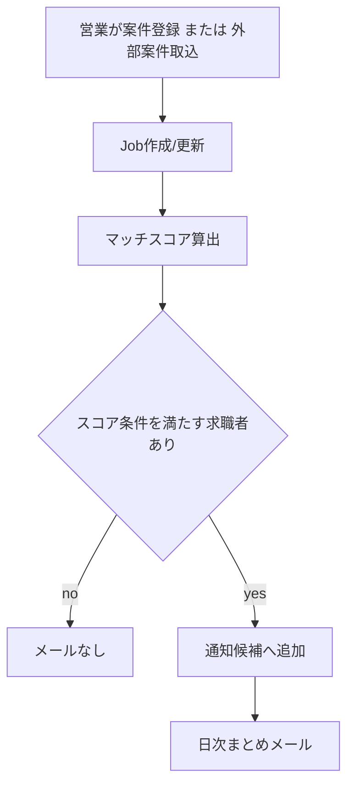

# メール送信パターン整理

現状の実装で実際にメール送信しているのは `POST /api/alive-checks` の稼働確認メールのみ。
一方で、Frichy の業務フロー上はWeb Pushだけでは見落としやすいイベントがあるため、以下をメール送信候補として整理する。

## 1. 判定方針

| 区分 | 方針 |
| ---- | ---- |
| 必須 | メールがないと本番機能として成立しにくい |
| 推奨 | 営業・求職者の見落としを防ぐため送ったほうがよい |
| 任意 | 送る価値はあるが、頻度制御しないとノイズになりやすい |
| 対象外 | ログ・画面・Web Pushで十分。メールすると混乱しやすい |

送信元はさくらSMTPで共通化し、宛先は以下を原則にする。

- 求職者宛: `users.email`
- 営業宛: `role = sales` かつ `isActive = true` の全営業ユーザー
- 問い合わせ返信宛: `contact_inquiries.email` を優先し、ログインユーザーのメールと差異がある場合も入力された連絡先へ送る

## 2. 全体一覧

| No | 区分 | イベント | 宛先 | タイミング | 現状 |
| --: | ---- | -------- | ---- | ---------- | ---- |
| 1 | 必須 | パスワード再設定申請 | 申請メールに一致する有効ユーザー | `PasswordResetToken` 作成直後 | 未実装。本番ではトークンを返さないためメール必須 |
| 2 | 推奨 | パスワード再設定完了 | 対象ユーザー | パスワード更新とtoken使用済み更新後 | 未実装 |
| 3 | 推奨 | 求職者の新規登録完了 | 登録した求職者 | `User` / `FreelancerProfile` / 同意記録作成後 | 未実装 |
| 4 | 推奨 | 求職者の新規登録通知 | 全営業ユーザー | 求職者登録完了後 | 未実装 |
| 5 | 推奨 | プロフィールが案件閲覧条件を満たした | 全営業ユーザー | `PUT /api/profile/me` 後、未達から達成へ変わった瞬間 | 未実装 |
| 6 | 推奨 | 稼働状況が `ready` に更新された | 全営業ユーザー | `availabilityStatus` が `ready` へ変わった直後 | 未実装 |
| 7 | 推奨 | 初回レジュメ登録/差し替え | 全営業ユーザー | `POST /api/resumes` 成功後 | 未実装 |
| 8 | 推奨 | 応募作成 | 全営業ユーザー | `POST /api/applications` で応募作成後 | 未実装 |
| 9 | 推奨 | 応募ステータス変更 | 応募した求職者 | `PATCH /api/applications/:id/status` で履歴作成後 | Web Pushのみ |
| 10 | 必須 | スカウト送信 | スカウト対象の求職者 | `messageType = scout` の `Message` 作成後 | Web Pushのみ |
| 11 | 推奨 | 通常チャット未読 | 受信者 | 送信後すぐではなく、一定時間未読かPush購読なしの場合 | Web Pushのみ |
| 12 | 推奨 | 面談候補作成 | 作成者の相手側 | `POST /api/meeting-requests` 成功後。ただし重複候補では送らない | 未実装 |
| 13 | 推奨 | 面談確定 | 求職者 | `PATCH /api/meeting-requests/:id/status` が `confirmed` になった後 | 画面側でチャット送信 + Web Push |
| 14 | 推奨 | 面談再調整 | 求職者 | `PATCH /api/meeting-requests/:id/status` が `reschedule` になった後 | 画面側でチャット送信 + Web Push |
| 15 | 推奨 | 初回面談完了 | 求職者 | `PATCH /api/freelancers/:id/initial-meeting` で完了になった後 | 未実装 |
| 16 | 推奨 | 問い合わせ作成 | 全営業ユーザー | `POST /api/contact-inquiries` 成功後 | Web Pushのみ |
| 17 | 推奨 | 問い合わせ回答/追加返信 | 問い合わせ作成者 | 営業が `answer` または `messages` を更新した後 | Web Pushのみ |
| 18 | 推奨 | 問い合わせ追加メッセージ | 全営業ユーザー | 求職者が `messages` を更新した後 | Web Pushのみ |
| 19 | 実装済み | 稼働確認 | 対象求職者 | 営業が `POST /api/alive-checks` を実行し、対象が存在する場合 | 実装済み |
| 20 | 任意 | 新規/取込案件のマッチ通知 | 条件に合う求職者 | 案件登録/外部取込後、即時ではなく日次まとめ推奨 | 未実装 |
| 21 | 対象外 | 期限切れ案件・応募削除 | なし | Cloud Scheduler実行時 | エンドユーザーには送らない |

## 3. 認証フロー

### 送信先とタイミング

| メール | 宛先 | 送信タイミング |
| ------ | ---- | -------------- |
| 登録完了 | 登録した求職者 | 登録transaction成功後 |
| 新規登録通知 | 全営業ユーザー | 登録transaction成功後 |
| パスワード再設定 | 申請メールに一致した有効ユーザー | token作成後。該当ユーザーなしの場合は送らない |
| パスワード再設定完了 | tokenに紐づくユーザー | パスワード更新後 |

## 4. プロフィール・レジュメフロー

### 送信先とタイミング

| メール | 宛先 | 送信タイミング |
| ------ | ---- | -------------- |
| プロフィール完成 | 全営業ユーザー | 必須項目が未達から達成へ変わった直後 |
| 稼働可能通知 | 全営業ユーザー | `availabilityStatus` が `ready` に変わった直後 |
| レジュメ更新通知 | 全営業ユーザー | 初回レジュメ登録または最新レジュメ差し替え後 |

## 5. 応募・選考フロー

### 送信先とタイミング

| メール | 宛先 | 送信タイミング |
| ------ | ---- | -------------- |
| 応募通知 | 全営業ユーザー | 応募作成後。重複応募エラー時は送らない |
| ステータス変更 | 応募した求職者 | ステータス履歴作成後 |

## 6. スカウト・チャットフロー

### 送信先とタイミング

| メール | 宛先 | 送信タイミング |
| ------ | ---- | -------------- |
| スカウト | 対象求職者 | `Message` 作成直後。案件詳細導線を含める |
| 未読チャット | 受信者 | 即時送信ではなく、5〜15分未読またはPush購読なしの場合 |

通常チャットはすぐメールにするとノイズが大きい。
スカウト、面談確定、応募ステータス変更のような業務イベントは即時メール、通常チャットは遅延メールまたは日次まとめがよい。

## 7. 面談フロー

### 送信先とタイミング

| メール | 宛先 | 送信タイミング |
| ------ | ---- | -------------- |
| 面談候補日通知 | 作成者の相手側 | 新規 `MeetingRequest` 作成後 |
| 面談確定 | 求職者 | `status = confirmed` 更新後 |
| 面談再調整 | 求職者 | `status = reschedule` 更新後 |
| 初回面談完了 | 求職者 | `initialMeetingCompleted = true` 更新後 |

面談確定/再調整は現在フロント側でチャット文も送るため、メール本文はチャット本文の要約にする。
同じ操作で「面談ステータスメール」と「チャットメール」を両方即時送信しない。

## 8. 問い合わせフロー

### 送信先とタイミング

| メール | 宛先 | 送信タイミング |
| ------ | ---- | -------------- |
| 新規問い合わせ | 全営業ユーザー | 問い合わせ作成後 |
| 回答通知 | `contact_inquiries.email` | 営業回答後 |
| 追加返信通知 | 相手側 | 追加メッセージ保存後 |

クローズはユーザー操作の完了状態なので、基本的にはメールしない。

## 9. 稼働確認フロー

### 送信先とタイミング

| メール | 宛先 | 送信タイミング |
| ------ | ---- | -------------- |
| 稼働確認 | `availabilityStatus != ready` または `lastUpdatedOn` が14日以上前の求職者 | `POST /api/alive-checks` 実行時 |

これは実装済み。
現状は営業手動実行APIであり、日次自動実行ではない。

## 10. 案件マッチ通知フロー

### 送信先とタイミング

| メール | 宛先 | 送信タイミング |
| ------ | ---- | -------------- |
| マッチ案件まとめ | `rankJobsByFreelancerMatch` で一定以上の求職者 | 案件作成直後ではなく日次まとめ推奨 |

案件取込は件数が増えやすいので、即時メールは避ける。
既読・応募済み・スカウト済みを除外して、1日1通にまとめるのがよい。

## 11. 対象外

| イベント | 理由 |
| -------- | ---- |
| ログイン成功/失敗 | 通常利用で頻発する。セキュリティ通知をやるなら別設計で実施 |
| 案件の公開/非公開切替 | 営業画面内の操作であり、全員へメールするとノイズが大きい |
| 期限切れ案件・応募削除 | エンドユーザーへの通知価値が低い。失敗監視はCloud Logging/Alertingで扱う |
| 問い合わせクローズ | 既に画面で状態確認でき、メールするとやり取り終了後に余計な通知になる |

## 12. 実装優先度

| 優先 | 対象 |
| ---- | ---- |
| P0 | パスワード再設定メール |
| P1 | スカウト、応募作成、応募ステータス変更、面談候補/確定/再調整、問い合わせ回答 |
| P2 | 新規登録通知、プロフィール完成、稼働可能通知、レジュメ更新、問い合わせ作成 |
| P3 | 通常チャット未読メール、案件マッチ日次まとめ |

最初に入れるなら、`EmailNotificationService` のような薄いアプリケーションサービスを作り、既存の `EmailSender` を直接各サービスに散らさない形にする。
メール本文生成、宛先解決、重複抑止、送信失敗ログを一箇所に寄せる。
